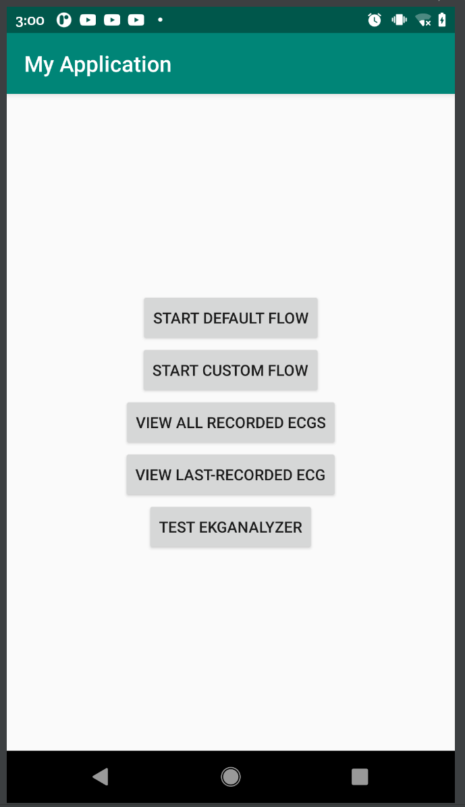

# ThirdParty Android Application SDK Test

Sample App for Android phones and tablets to show how to use AliveCorKit or AliveCorKitLite

### NOTE: KardiaStation App moved outside this sample app repo with all branches tags and git history, full git clone to the new repo -
### https://github.com/alivecor/KardiaStation-Android. 

#### Please use that repository to proceed with KardiaStation Project.

### Notes: 
- Please switch to the default 'develop' branch, and use this repo to improve the sample app only.

 